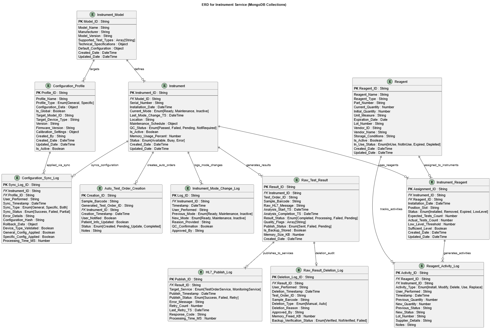

# ERD and Schema for Instrument Service



## 📋 Mục Lục

1. [Tổng quan](#1-tổng-quan)
2. [Core Entities (Collection 1-3)](#2-core-entities-collection-1-3)
   - 2.1 [Collection 1: Instrument_Model](#21-collection-1-instrument_model)
   - 2.2 [Collection 2: Instrument](#22-collection-2-instrument)
   - 2.3 [Collection 3: Instrument_Mode_Change_Log](#23-collection-3-instrument_mode_change_log)
3. [Test Results Management (Collection 4-7)](#3-test-results-management-collection-4-7)
   - 3.1 [Collection 4: Raw_Test_Result](#31-collection-4-raw_test_result)
   - 3.2 [Collection 5: HL7_Publish_Log](#32-collection-5-hl7_publish_log)
   - 3.3 [Collection 6: Raw_Result_Deletion_Log](#33-collection-6-raw_result_deletion_log)
   - 3.4 [Collection 7: Auto_Test_Order_Creation](#34-collection-7-auto_test_order_creation)
4. [Reagents Management (Collection 8-10)](#4-reagents-management-collection-8-10)
   - 4.1 [Collection 8: Reagent](#41-collection-8-reagent)
   - 4.2 [Collection 9: Instrument_Reagent](#42-collection-9-instrument_reagent)
   - 4.3 [Collection 10: Reagent_Activity_Log](#43-collection-10-reagent_activity_log)
5. [Configuration Management (Collection 11-12)](#5-configuration-management-collection-11-12)
   - 5.1 [Collection 11: Configuration_Profile](#51-collection-11-configuration_profile)
   - 5.2 [Collection 12: Configuration_Sync_Log](#52-collection-12-configuration_sync_log)
6. [Relationships & Business Rules](#6-relationships--business-rules)

---

## 1. Tổng quan

Sơ đồ ERD (Entity Relationship Diagram) này mô tả cấu trúc cơ sở dữ liệu MongoDB cho **Instrument Service** - một thành phần quan trọng trong hệ thống Quản lý Phòng thí nghiệm (Laboratory Management System). Dịch vụ này quản lý toàn bộ quy trình xét nghiệm thiết bị, thuốc thử và cấu hình cho các thiết bị phân tích huyết học.

### 🏗️ Cấu trúc Module theo ERD - Tổng quan Chi tiết

| Module | Collections | Count | Mô tả chi tiết | Lý do nhóm |
|--------|-------------|-------|----------------|------------|
| **1. Core Entities<br/>(Collection 1-3)** | • **Instrument_Model**: Định nghĩa các loại thiết bị<br/>• **Instrument**: Thông tin thiết bị cụ thể<br/>• **Instrument_Mode_Change_Log**: Audit log thay đổi mode | **3** | **Quản lý thiết bị vật lý và audit trail**<br/>- Master data các model thiết bị<br/>- Thông tin runtime của từng thiết bị<br/>- Truy vết mọi thay đổi trạng thái | Entities cốt lõi về **thiết bị vật lý** và audit trail của chúng |
| **2. Test Results Management<br/>(Collection 4-7)** | • **Raw_Test_Result**: Kết quả xét nghiệm thô<br/>• **HL7_Publish_Log**: Log việc publish kết quả<br/>• **Raw_Result_Deletion_Log**: Audit việc xóa kết quả<br/>• **Auto_Test_Order_Creation**: Tự động tạo test order | **4** | **Toàn bộ lifecycle kết quả xét nghiệm**<br/>- Lưu trữ kết quả thô từ thiết bị<br/>- Theo dõi việc publish sang services khác<br/>- Audit việc xóa data (compliance)<br/>- Tự động tạo order khi thiếu | Tất cả liên quan đến **lifecycle của kết quả xét nghiệm** - từ tạo, publish, đến xóa và auto-creation |
| **3. Reagents Management<br/>(Collection 8-10)** | • **Reagent**: Thông tin thuốc thử<br/>• **Instrument_Reagent**: Gán thuốc thử cho thiết bị<br/>• **Reagent_Activity_Log**: Audit hoạt động thuốc thử | **3** | **Quản lý toàn bộ lifecycle thuốc thử**<br/>- Inventory và thông tin thuốc thử<br/>- Assignment thuốc thử cho từng thiết bị<br/>- Tracking usage và các hoạt động | Quản lý toàn bộ **lifecycle thuốc thử** - từ inventory, assignment đến usage tracking |
| **4. Configuration Management<br/>(Collection 11-12)** | • **Configuration_Profile**: Các profile cấu hình<br/>• **Configuration_Sync_Log**: Log việc sync cấu hình | **2** | **Cấu hình hệ thống và audit đồng bộ**<br/>- Templates cấu hình cho các loại thiết bị<br/>- Theo dõi việc apply cấu hình<br/>- Rollback và error handling | Quản lý **cấu hình hệ thống** và audit trail của việc áp dụng cấu hình |
| **🎯 Total** | **Complete Laboratory Workflow** | **12** | **End-to-end Laboratory Management**<br/>Covering: Device → Results → Reagents → Configuration | **Kiến trúc Microservices** - mỗi module độc lập nhưng có integration points |

### 🎯 Kiến trúc Microservices
Cách phân chia này **tuân thủ kiến trúc microservices** - mỗi service chỉ quản lý domain của mình:
- **Test_Order được quản lý bởi Test Order Service** (không store trong Instrument Service)
- **Instrument Service** chỉ reference Test_Order_ID và tự động tạo order khi cần thiết
- **Clear separation of concerns** cho từng functional domain

---

## 2. Core Entities (Collection 1-3)

### 2.1 📋 Collection 1: Instrument_Model (Collection: `instrument_models`)
**🎯 Mục đích**: Định nghĩa các loại model thiết bị và thông số kỹ thuật chuẩn cho từng model.

#### Schema Definition
| Trường | Kiểu dữ liệu | Mô tả | Validation Rules |
|--------|--------------|-------|------------------|
| **Model_ID** | String (PK) | ID model thiết bị | Auto-generated |
| Model_Name | String | Tên model | Required, Max 100 chars |
| Manufacturer | String | Nhà sản xuất | Required |
| Model_Version | String | Phiên bản model | Required |
| Supported_Test_Types | Array[String] | Loại xét nghiệm hỗ trợ | Required, Min 1 item |
| Technical_Specifications | Object | Thông số kỹ thuật | JSON format |
| Default_Configuration | Object | Cấu hình mặc định | JSON format |
| Created_Date | DateTime | Ngày tạo | Auto-generated |
| Updated_Date | DateTime | Ngày cập nhật | Auto-updated |

#### 📄 Ví dụ Document Complete
```json
{
  "_id": ObjectId("64f123456789abcdef012345"),
  "Model_ID": "MDL_XN1000_SYSMEX_V1",
  "Model_Name": "XN-1000 Hematology Analyzer",
  "Manufacturer": "Sysmex Corporation",
  "Model_Version": "v2.1.0",
  "Supported_Test_Types": [
    "CBC", "CBC+Diff", "Reticulocyte", "Body Fluid", "PLT-F"
  ],
  "Technical_Specifications": {
    "throughput": "100 samples/hour",
    "sample_volume": "88μL whole blood",
    "measurement_parameters": 29,
    "measurement_methods": ["Flow Cytometry", "Hydrodynamic Focusing"],
    "barcode_capability": true,
    "connectivity": ["LIS", "Middleware", "HL7"]
  },
  "Default_Configuration": {
    "auto_sample_prep": true,
    "auto_dilution": true,
    "qc_frequency": "daily",
    "maintenance_interval": "monthly",
    "calibration_validity": 30
  },
  "Performance_Specs": {
    "precision_cv": "<2%",
    "linearity": "0.5-80 x10³/μL (WBC)",
    "carryover": "<0.5%"
  },
  "Created_Date": ISODate("2024-01-15T00:00:00.000Z"),
  "Updated_Date": ISODate("2024-10-07T10:30:00.000Z")
}
```

#### 🔧 Business Rules cho Instrument_Model
- **Master Data**: Không được xóa khi có instruments đang sử dụng
- **Version Control**: Model_Version phải theo semantic versioning
- **Test Types**: Supported_Test_Types không được empty
- **Specifications**: Technical_Specifications phải có đầy đủ thông tin cần thiết
- **ID Format**: `MDL_{ModelName}_{Manufacturer}_{Version}`

### 2.2 🔬 Collection 2: Instrument (Collection: `instruments`)
**🎯 Mục đích**: Quản lý thông tin thiết bị cụ thể và trạng thái runtime.

#### Schema Definition
| Trường | Kiểu dữ liệu | Mô tả | Runtime Info |
|--------|--------------|-------|--------------|
| **Instrument_ID** | String (PK) | ID thiết bị duy nhất | Auto-generated |
| **Model_ID** | String (FK) | Model thiết bị | References Instrument_Model |
| Serial_Number | String | Số serial | Required, Unique |
| Installation_Date | DateTime | Ngày lắp đặt | Required |
| Current_Mode | Enum | Mode hiện tại | [Ready, Maintenance, Inactive] |
| Last_Mode_Change_TS | DateTime | Thời điểm thay đổi mode cuối | Auto-updated |
| Location | String | Vị trí đặt thiết bị | Required |
| Maintenance_Schedule | Object | Lịch bảo trì | JSON format |
| QC_Status | Enum | Trạng thái QC | [Passed, Failed, Pending, NotRequired] |
| Is_Active | Boolean | Đang hoạt động | Default: true |
| Memory_Usage_Percent | Number | % sử dụng memory | 0-100 |
| Status | Enum | Trạng thái | [Available, Busy, Error] |

#### 📄 Ví dụ Document Complete
```json
{
  "_id": ObjectId("64f123456789abcdef012346"),
  "Instrument_ID": "INS_LAB1_XN1000_001",
  "Model_ID": "MDL_XN1000_SYSMEX_V1",
  "Device_Info": {
    "serial_number": "XN1000-2024-001",
    "installation_date": ISODate("2024-03-15T00:00:00.000Z"),
    "location": "Hematology Lab - Station 1",
    "asset_number": "ASSET_2024_001"
  },
  "Current_Status": {
    "current_mode": "Ready",
    "last_mode_change_ts": ISODate("2024-10-07T08:00:00.000Z"),
    "status": "Available",
    "is_active": true
  },
  "Quality_Control": {
    "qc_status": "Passed",
    "last_qc_run": ISODate("2024-10-07T07:00:00.000Z"),
    "qc_due_date": ISODate("2024-10-08T07:00:00.000Z"),
    "qc_results": {
      "wbc_cv": 1.2,
      "rbc_cv": 0.8,
      "plt_cv": 2.1
    }
  },
  "Maintenance_Schedule": {
    "daily_maintenance": "07:00",
    "weekly_maintenance": "Sunday 18:00",
    "monthly_maintenance": "First Sunday 09:00",
    "last_maintenance": ISODate("2024-10-06T18:00:00.000Z"),
    "next_maintenance": ISODate("2024-10-13T18:00:00.000Z")
  },
  "Performance_Metrics": {
    "memory_usage_percent": 45,
    "daily_throughput": 856,
    "error_rate": 0.2,
    "uptime_percent": 99.8
  },
  "Created_Date": ISODate("2024-03-15T10:00:00.000Z"),
  "Updated_Date": ISODate("2024-10-07T08:30:00.000Z")
}
```

#### 🔧 Business Rules cho Instrument
- **Unique Serial**: Serial_Number phải unique trong hệ thống
- **Mode Transition**: Chỉ cho phép Ready↔Maintenance↔Inactive
- **QC Validation**: Không thể chuyển sang Ready nếu QC_Status = Failed
- **Memory Threshold**: Cảnh báo khi Memory_Usage_Percent > 80%
- **ID Format**: `INS_{Location}_{ModelName}_{Number}`

### 2.3 🔄 Collection 3: Instrument_Mode_Change_Log (Collection: `mode_change_logs`)
**🎯 Mục đích**: Theo dõi tất cả thay đổi mode của thiết bị cho audit và troubleshooting.

#### Schema Definition
| Trường | Kiểu dữ liệu | Mô tả | Audit Purpose |
|--------|--------------|-------|---------------|
| **Log_ID** | String (PK) | ID log thay đổi mode | Auto-generated |
| **Instrument_ID** | String (FK) | Thiết bị thay đổi | References Instrument |
| Timestamp | DateTime | Thời điểm thay đổi | Auto-generated |
| User_Performed | String | Người thực hiện | Required |
| Previous_Mode | Enum | Mode trước | [Ready, Maintenance, Inactive] |
| New_Mode | Enum | Mode mới | [Ready, Maintenance, Inactive] |
| Reason_Provided | String | Lý do thay đổi | Required |
| QC_Confirmation | Boolean | Xác nhận QC | Required for Ready mode |
| Approved_By | String | Người phê duyệt | Required |

#### 📄 Ví dụ Document Complete
```json
{
  "_id": ObjectId("64f123456789abcdef012347"),
  "Log_ID": "MODE_20241007_001",
  "Instrument_ID": "INS_LAB1_XN1000_001",
  "Mode_Change_Details": {
    "timestamp": ISODate("2024-10-07T08:30:00.000Z"),
    "user_performed": "TECH_001",
    "previous_mode": "Maintenance",
    "new_mode": "Ready",
    "reason_provided": "Completed scheduled maintenance and QC validation",
    "qc_confirmation": true,
    "approved_by": "SUPERVISOR_001"
  },
  "Pre_Change_Validation": {
    "qc_status": "Passed",
    "reagent_levels": "Sufficient", 
    "maintenance_completed": true,
    "calibration_current": true,
    "system_errors": "None"
  },
  "Post_Change_Status": {
    "mode_set_successfully": true,
    "system_ready": true,
    "first_test_timestamp": ISODate("2024-10-07T08:45:00.000Z"),
    "performance_normal": true
  },
  "Approval_Chain": {
    "requested_by": "TECH_001",
    "approved_by": "SUPERVISOR_001",
    "approval_timestamp": ISODate("2024-10-07T08:25:00.000Z"),
    "approval_comments": "QC passed, maintenance complete"
  }
}
```

#### 🔧 Business Rules cho Instrument_Mode_Change_Log
- **Immutable**: Audit logs không được sửa đổi sau khi tạo
- **QC Requirement**: Chuyển sang Ready bắt buộc QC_Confirmation = true
- **Approval Chain**: Mọi thay đổi mode đều phải có approval
- **Automatic Logging**: Tự động tạo log cho mọi mode change
- **ID Format**: `MODE_{YYYYMMDD}_{SequenceNumber}`

---

## 3. Test Results Management (Collection 4-7)

### 3.1 📊 Collection 4: Raw_Test_Result (Collection: `raw_test_results`)
**🎯 Mục đích**: Lưu trữ kết quả xét nghiệm thô từ thiết bị và quản lý lifecycle của chúng.

#### Schema Definition
| Trường | Kiểu dữ liệu | Mô tả | Data Management |
|--------|--------------|-------|-----------------|
| **Result_ID** | String (PK) | ID kết quả duy nhất | Auto-generated |
| **Instrument_ID** | String (FK) | Thiết bị tạo kết quả | References Instrument |
| Test_Order_ID | String | ID lệnh xét nghiệm | May be auto-generated |
| Sample_Barcode | String | Mã vạch mẫu | Required |
| Raw_HL7_Message | String | Message HL7 thô | Required, Large text |
| Analysis_Start_TS | DateTime | Thời điểm bắt đầu phân tích | Auto-generated |
| Analysis_Completion_TS | DateTime | Thời điểm hoàn thành | Auto-generated |
| Result_Status | Enum | Trạng thái kết quả | [Completed, Processing, Failed, Pending] |
| Quality_Flags | Array[String] | Các flag chất lượng | Optional |
| Publish_Status | Enum | Trạng thái publish | [Sent, Failed, Pending] |
| Is_Backup_Stored | Boolean | Đã backup | Default: false |
| Memory_Size_KB | Number | Kích thước data | For cleanup |

#### 📄 Ví dụ Document Complete
```json
{
  "_id": ObjectId("64f123456789abcdef012348"),
  "Result_ID": "RST_20241007_001",
  "Instrument_ID": "INS_LAB1_XN1000_001",
  "Test_Info": {
    "test_order_id": "ORD_2024_1007_0001",
    "sample_barcode": "SMP20241007001",
    "test_type": "CBC+Diff",
    "operator_id": "TECH_001"
  },
  "Timing_Info": {
    "analysis_start_ts": ISODate("2024-10-07T09:15:00.000Z"),
    "analysis_completion_ts": ISODate("2024-10-07T09:18:30.000Z"),
    "processing_time_seconds": 210
  },
  "Raw_HL7_Message": "MSH|^~\\&|XN1000|LAB1|LIS|HOSPITAL|20241007091830||ORU^R01|MSG001|P|2.5\nPID|1||PAT001||Nguyen^Van^A||19900101|M\nOBR|1||ORD_2024_1007_0001|CBC+Diff||20241007091500\nOBX|1|NM|WBC|5.8|10*3/uL|4.0-10.0|N|||F\nOBX|2|NM|RBC|4.2|10*6/uL|4.0-5.2|N|||F",
  "Result_Status": "Completed",
  "Quality_Control": {
    "quality_flags": ["Normal", "No Interference"],
    "qc_level": "Level_2",
    "sample_quality": "Good"
  },
  "Publishing_Info": {
    "publish_status": "Sent",
    "publish_attempts": 1,
    "last_publish_ts": ISODate("2024-10-07T09:19:00.000Z"),
    "target_services": ["TestOrderService", "MonitoringService"]
  },
  "Storage_Info": {
    "is_backup_stored": true,
    "backup_location": "MonitoringService_Backup_DB",
    "memory_size_kb": 12.5,
    "retention_until": ISODate("2024-10-14T09:18:30.000Z")
  },
  "Created_Date": ISODate("2024-10-07T09:18:30.000Z")
}
```

#### 🔧 Business Rules cho Raw_Test_Result
- **Data Integrity**: Raw_HL7_Message không được modify sau khi tạo
- **Retention Policy**: Xóa sau 7 ngày nếu đã backup và publish thành công
- **Quality Flags**: Tự động validate và gắn quality flags
- **Publish Requirement**: Phải publish thành công trước khi cleanup
- **ID Format**: `RST_{YYYYMMDD}_{SequenceNumber}`

### 3.2 📤 Collection 5: HL7_Publish_Log (Collection: `hl7_publish_logs`)
**🎯 Mục đích**: Theo dõi việc publish kết quả HL7 tới các service khác và retry mechanism.

#### Schema Definition
| Trường | Kiểu dữ liệu | Mô tả | Publish Tracking |
|--------|--------------|-------|------------------|
| **Publish_ID** | String (PK) | ID publish duy nhất | Auto-generated |
| **Result_ID** | String (FK) | Kết quả được publish | References Raw_Test_Result |
| Target_Service | Enum | Service đích | [TestOrderService, MonitoringService] |
| Publish_Timestamp | DateTime | Thời điểm publish | Auto-generated |
| Publish_Status | Enum | Trạng thái publish | [Success, Failed, Retry] |
| Error_Message | String | Lỗi nếu có | Nullable |
| Retry_Count | Number | Số lần retry | Default: 0 |
| Last_Retry_TS | DateTime | Lần retry cuối | Nullable |
| Response_Code | String | Mã response | HTTP status |
| Processing_Time_MS | Number | Thời gian xử lý | Performance metric |

#### 📄 Ví dụ Document Complete
```json
{
  "_id": ObjectId("64f123456789abcdef012349"),
  "Publish_ID": "PUB_20241007_001",
  "Result_ID": "RST_20241007_001",
  "Target_Service": "TestOrderService",
  "Publishing_Details": {
    "publish_timestamp": ISODate("2024-10-07T09:19:00.000Z"),
    "publish_status": "Success",
    "response_code": "200",
    "processing_time_ms": 245
  },
  "Request_Info": {
    "endpoint": "https://testorder-service/api/v1/results",
    "method": "POST",
    "content_type": "application/hl7-v2",
    "message_size_kb": 12.5
  },
  "Response_Info": {
    "response_timestamp": ISODate("2024-10-07T09:19:00.245Z"),
    "response_message": "Result received and processed successfully",
    "correlation_id": "CORR_20241007_001"
  },
  "Retry_Info": {
    "retry_count": 0,
    "max_retries": 3,
    "retry_interval_seconds": 30,
    "last_retry_ts": null
  },
  "Performance_Metrics": {
    "network_latency_ms": 45,
    "service_response_time_ms": 200,
    "total_processing_time_ms": 245
  }
}
```

#### 🔧 Business Rules cho HL7_Publish_Log
- **Retry Logic**: Tối đa 3 lần retry với exponential backoff
- **Timeout**: 30 giây timeout cho mỗi publish attempt
- **Success Criteria**: Response_Code = 200 và valid response message
- **Error Handling**: Log chi tiết error message cho troubleshooting
- **ID Format**: `PUB_{YYYYMMDD}_{SequenceNumber}`

### 3.3 🗑️ Collection 6: Raw_Result_Deletion_Log (Collection: `result_deletion_logs`)
**🎯 Mục đích**: Audit trail cho việc xóa kết quả thô, tuân thủ các quy định về compliance và traceability.

#### Schema Definition
| Trường | Kiểu dữ liệu | Mô tả | Compliance |
|--------|--------------|-------|------------|
| **Deletion_Log_ID** | String (PK) | ID log xóa | Auto-generated |
| **Result_ID** | String (FK) | Kết quả đã xóa | May be null after deletion |
| User_Performed | String | Người thực hiện (manual) | Nullable for auto |
| Deletion_Timestamp | DateTime | Thời điểm xóa | Required |
| Test_Order_ID | String | ID lệnh xét nghiệm đã xóa | For audit |
| Sample_Barcode | String | Mã vạch đã xóa | For audit |
| Deletion_Type | Enum | Loại xóa | [Manual, Auto, Scheduled] |
| Deletion_Reason | String | Lý do xóa | Required |
| Approved_By | String | Người phê duyệt | Required for manual |
| Memory_Freed_KB | Number | Bộ nhớ được giải phóng | Performance tracking |
| Backup_Verification_Status | Enum | Xác minh backup | [Verified, NotVerified, Failed] |

#### 📄 Ví dụ Document Complete
```json
{
  "_id": ObjectId("64f123456789abcdef01234a"),
  "Deletion_Log_ID": "DEL_20241007_001",
  "Result_ID": "RST_20241006_045",
  "Deletion_Details": {
    "user_performed": "SYSTEM_AUTO",
    "deletion_timestamp": ISODate("2024-10-07T12:00:00.000Z"),
    "deletion_type": "Auto",
    "deletion_reason": "Automatic cleanup - data older than retention period",
    "approved_by": "SYSTEM_AUTO"
  },
  "Original_Data_Info": {
    "test_order_id": "ORD_2024_1006_0045",
    "sample_barcode": "SMP20241006045", 
    "instrument_id": "INS_LAB1_XN1000_001",
    "test_type": "CBC+Diff",
    "analysis_timestamp": ISODate("2024-10-06T14:30:00.000Z")
  },
  "System_Metrics": {
    "memory_freed_kb": 15.7,
    "storage_freed_mb": 0.8,
    "processing_time_ms": 45
  },
  "Backup_Information": {
    "backup_verification_status": "Verified",
    "backup_location": "MonitoringService_Backup_DB",
    "backup_timestamp": ISODate("2024-10-06T15:00:00.000Z"),
    "backup_checksum": "a1b2c3d4e5f6...",
    "verification_timestamp": ISODate("2024-10-07T11:58:00.000Z")
  },
  "Compliance_Info": {
    "regulatory_requirement": "Data retention 7 days after backup",
    "retention_period_days": 7,
    "deletion_policy_version": "v2.1",
    "audit_trail_preserved": true
  }
}
```

#### 🔧 Business Rules cho Raw_Result_Deletion_Log
- **Backup Required**: Chỉ xóa khi Backup_Verification_Status = "Verified"
- **Retention**: Audit logs giữ vĩnh viễn, không xóa
- **Approval**: Manual deletion cần approval từ supervisor
- **Compliance**: Tuân thủ quy định về data retention
- **ID Format**: `DEL_{YYYYMMDD}_{SequenceNumber}`

### 3.4 🔄 Collection 7: Auto_Test_Order_Creation (Collection: `auto_test_orders`)
**🎯 Mục đích**: Quản lý việc tự động tạo test order khi có barcode nhưng thiếu test order trong hệ thống.

#### Schema Definition
| Trường | Kiểu dữ liệu | Mô tả | Workflow |
|--------|--------------|-------|----------|
| **Creation_ID** | String (PK) | ID tạo tự động | Auto-generated |
| Sample_Barcode | String | Mã vạch mẫu | Trigger condition |
| Generated_Test_Order_ID | String | Test order được tạo | Auto-generated |
| **Instrument_ID** | String (FK) | Thiết bị tạo | References Instrument |
| Creation_Timestamp | DateTime | Thời điểm tạo | Auto-generated |
| User_Notified | Boolean | Đã thông báo user | Default: false |
| Patient_Info_Updated | Boolean | Đã cập nhật thông tin BN | Default: false |
| Status | Enum | Trạng thái | [Created, Pending_Update, Completed] |
| Notes | String | Ghi chú | Optional |

#### 📄 Ví dụ Document Complete
```json
{
  "_id": ObjectId("64f123456789abcdef01234b"),
  "Creation_ID": "AUTO_20241007_001",
  "Sample_Barcode": "SMP20241007002",
  "Generated_Test_Order_ID": "ORD_AUTO_2024_1007_0001",
  "Instrument_ID": "INS_LAB1_XN1000_001",
  "Creation_Timestamp": ISODate("2024-10-07T11:15:00.000Z"),
  "Trigger_Context": {
    "reason": "Sample scanned but no existing order found",
    "scan_timestamp": ISODate("2024-10-07T11:14:45.000Z"),
    "operator_id": "TECH_001",
    "sample_type": "Whole Blood"
  },
  "Auto_Order_Details": {
    "default_tests": ["CBC", "CBC+Diff"],
    "priority": "Routine",
    "estimated_completion": ISODate("2024-10-07T12:15:00.000Z"),
    "auto_approval": false
  },
  "Patient_Info": {
    "patient_id_placeholder": "UNKNOWN_PAT_001",
    "sample_collection_time": ISODate("2024-10-07T10:30:00.000Z"),
    "collection_location": "Ward A"
  },
  "Notification_Status": {
    "user_notified": true,
    "notification_timestamp": ISODate("2024-10-07T11:15:30.000Z"),
    "notification_method": "Email+SMS",
    "notified_users": ["lab_supervisor@hospital.com", "tech_001@hospital.com"]
  },
  "Status": "Pending_Update",
  "Notes": "Auto-created due to missing order. Awaiting patient information update from nursing staff."
}
```

#### 🔧 Business Rules cho Auto_Test_Order_Creation
- **Trigger Condition**: Tự động trigger khi scan barcode không có order
- **Default Tests**: Áp dụng test mặc định theo instrument model
- **Notification Required**: Phải notify user trong vòng 5 phút
- **Manual Update**: Cần cập nhật patient info manually sau khi tạo
- **ID Format**: `AUTO_{YYYYMMDD}_{SequenceNumber}`

---

## 4. Reagents Management (Collection 8-10)

### 4.1 🧪 Collection 8: Reagent (Collection: `reagents`)
**🎯 Mục đích**: Quản lý thông tin thuốc thử, inventory và lifecycle từ nhập kho đến sử dụng.

#### Schema Definition
| Trường | Kiểu dữ liệu | Mô tả | Validation Rules |
|--------|--------------|-------|------------------|
| **Reagent_ID** | String (PK) | ID duy nhất thuốc thử | Auto-generated |
| Reagent_Name | String | Tên thuốc thử | Required, Max 200 chars |
| Reagent_Type | String | Loại thuốc thử | Required |
| Part_Number | String | Số part của nhà sản xuất | Required for traceability |
| Current_Quantity | Number | Số lượng hiện tại | >= 0 |
| Initial_Quantity | Number | Số lượng ban đầu | > 0 |
| Unit_Measure | String | Đơn vị đo | [mL, μL, tests, units, vials] |
| Expiration_Date | Date | Ngày hết hạn | Must be future date on creation |
| Lot_Number | String | Số lô | Required for traceability |
| Vendor_ID | String | ID nhà cung cấp | References Vendor |
| Vendor_Name | String | Tên nhà cung cấp | Required |
| Storage_Conditions | Object | Điều kiện bảo quản | JSON format |
| Is_Active | Boolean | Còn hoạt động | Default: true |
| In_Use_Status | Enum | Trạng thái sử dụng | [InUse, NotInUse, Expired, Depleted] |

#### 📄 Ví dụ Document Complete
```json
{
  "_id": ObjectId("64f123456789abcdef01234c"),
  "Reagent_ID": "REA_SYS_CBC_202410_001", 
  "Reagent_Name": "Sysmex CBC reagent kit",
  "Reagent_Type": "Analysis Reagent",
  "Part_Number": "XN-991-001-SYS",
  "Inventory_Info": {
    "current_quantity": 755,
    "initial_quantity": 1000,
    "unit_measure": "tests",
    "quantity_used": 245,
    "usage_rate_per_day": 50
  },
  "Expiration_Info": {
    "expiration_date": ISODate("2025-09-15T00:00:00.000Z"),
    "lot_number": "LOT_202409_SYS_001",
    "days_until_expiry": 343,
    "expiry_alert_threshold": 30
  },
  "Supplier_Info": {
    "vendor_id": "VENDOR_SYSMEX_VN",
    "vendor_name": "Sysmex Medical Vietnam",
    "purchase_order": "PO_2024_09_001",
    "received_date": ISODate("2024-09-01T00:00:00.000Z"),
    "batch_certificate": "CERT_202409_001"
  },
  "Storage_Conditions": {
    "temperature_range": "2-8°C",
    "humidity_max": "85%",
    "light_protection": true,
    "storage_location": "Reagent Fridge A-02"
  },
  "Status_Info": {
    "is_active": true,
    "in_use_status": "InUse",
    "quality_control_status": "Passed",
    "last_qc_date": ISODate("2024-10-01T00:00:00.000Z")
  },
  "Created_Date": ISODate("2024-09-01T08:00:00.000Z"),
  "Updated_Date": ISODate("2024-10-07T10:30:00.000Z")
}
```

#### 🔧 Business Rules cho Reagent
- **Expiry Management**: Cảnh báo khi còn 30 ngày hết hạn
- **Inventory Threshold**: Alert khi Current_Quantity < 20% Initial_Quantity
- **Lot Traceability**: Lot_Number bắt buộc cho compliance
- **Storage Compliance**: Kiểm tra storage conditions thường xuyên
- **ID Format**: `REA_{Vendor}_{Type}_{YYYYMM}_{Number}`

### 4.2 🔗 Collection 9: Instrument_Reagent (Collection: `instrument_reagents`)
**🎯 Mục đích**: Quản lý việc gán thuốc thử cho từng thiết bị và theo dõi usage.

#### Schema Definition
| Trường | Kiểu dữ liệu | Mô tả | Assignment Info |
|--------|--------------|-------|-----------------|
| **Assignment_ID** | String (PK) | ID gán thuốc thử | Auto-generated |
| **Instrument_ID** | String (FK) | Thiết bị sử dụng | References Instrument |
| **Reagent_ID** | String (FK) | Thuốc thử được gán | References Reagent |
| Installation_Date | DateTime | Ngày lắp đặt | Required |
| Position_Slot | String | Vị trí slot trên máy | Required |
| Status | Enum | Trạng thái | [Installed, Removed, Expired, LowLevel] |
| Expected_Tests_Count | Number | Số test dự kiến | Based on reagent capacity |
| Actual_Tests_Count | Number | Số test thực tế | Auto-increment |
| Low_Level_Threshold | Number | Ngưỡng báo thiếu | Configurable |
| Sufficient_Level | Boolean | Đủ mức sử dụng | Auto-calculated |

#### 📄 Ví dụ Document Complete
```json
{
  "_id": ObjectId("64f123456789abcdef01234d"),
  "Assignment_ID": "ASG_INS001_REA001_20241007",
  "Instrument_ID": "INS_LAB1_XN1000_001",
  "Reagent_ID": "REA_SYS_CBC_202410_001",
  "Installation_Info": {
    "installation_date": ISODate("2024-10-07T08:00:00.000Z"),
    "position_slot": "R1-A",
    "installed_by": "TECH_001",
    "installation_verified": true
  },
  "Usage_Tracking": {
    "expected_tests_count": 1000,
    "actual_tests_count": 245,
    "remaining_tests": 755,
    "usage_rate_per_day": 50,
    "estimated_depletion_date": ISODate("2024-10-22T00:00:00.000Z")
  },
  "Status_Info": {
    "status": "Installed",
    "low_level_threshold": 100,
    "sufficient_level": true,
    "last_usage": ISODate("2024-10-07T10:30:00.000Z")
  },
  "Performance_Metrics": {
    "efficiency_rate": 98.5,
    "error_count": 2,
    "maintenance_due": false
  },
  "Quality_Control": {
    "qc_status": "Passed",
    "last_qc_check": ISODate("2024-10-07T07:30:00.000Z"),
    "next_qc_due": ISODate("2024-10-14T07:30:00.000Z")
  },
  "Created_Date": ISODate("2024-10-07T08:00:00.000Z"),
  "Updated_Date": ISODate("2024-10-07T10:50:00.000Z")
}
```

#### 🔧 Business Rules cho Instrument_Reagent
- **Position Validation**: Mỗi slot chỉ có 1 reagent active
- **Sufficient_Level Calculation**: Auto-update dựa trên actual vs threshold
- **Usage Tracking**: Auto-increment Actual_Tests_Count sau mỗi test
- **Status Management**: Auto chuyển "LowLevel" khi < threshold
- **ID Format**: `ASG_{InstrumentID}_{ReagentID}_{YYYYMMDD}`

### 4.3 📋 Collection 10: Reagent_Activity_Log (Collection: `reagent_activity_logs`)
**🎯 Mục đích**: Audit trail cho tất cả hoạt động liên quan đến thuốc thử và lifecycle management.

#### Schema Definition
| Trường | Kiểu dữ liệu | Mô tả | Audit Purpose |
|--------|--------------|-------|---------------|
| **Activity_ID** | String (PK) | ID hoạt động | Auto-generated |
| **Reagent_ID** | String (FK) | Thuốc thử | References Reagent |
| **Instrument_ID** | String (FK) | Thiết bị liên quan | References Instrument |
| Activity_Type | Enum | Loại hoạt động | [Install, Modify, Delete, Use, Replace] |
| User_Performed | String | Người thực hiện | Required for manual actions |
| Timestamp | DateTime | Thời điểm hoạt động | Auto-generated |
| Previous_Quantity | Number | Số lượng trước | For quantity changes |
| New_Quantity | Number | Số lượng sau | For quantity changes |
| Previous_Status | String | Trạng thái trước | For status changes |
| New_Status | String | Trạng thái sau | For status changes |
| Lot_Number | String | Số lô | For traceability |
| Notes | String | Ghi chú thêm | Optional |

#### 📄 Ví dụ Document Complete
```json
{
  "_id": ObjectId("64f123456789abcdef01234e"),
  "Activity_ID": "ACT_20241007_001",
  "Reagent_ID": "REA_SYS_CBC_202410_001",
  "Instrument_ID": "INS_LAB1_XN1000_001",
  "Activity_Details": {
    "activity_type": "Use",
    "user_performed": "SYSTEM_AUTO",
    "timestamp": ISODate("2024-10-07T10:30:00.000Z")
  },
  "Quantity_Changes": {
    "previous_quantity": 755,
    "new_quantity": 750,
    "usage_amount": 5,
    "unit_measure": "tests"
  },
  "Status_Changes": {
    "previous_status": "InUse",
    "new_status": "InUse",
    "sufficient_level_before": true,
    "sufficient_level_after": true
  },
  "Test_Context": {
    "test_order_id": "ORD_2024_1007_0123",
    "sample_barcode": "SMP20241007001",
    "test_type": "CBC+Diff"
  },
  "Traceability_Info": {
    "lot_number": "LOT_202409_SYS_001",
    "expiration_date": ISODate("2025-09-15T00:00:00.000Z"),
    "supplier_details": "Sysmex Medical Vietnam"
  },
  "Performance_Metrics": {
    "remaining_tests_estimated": 750,
    "daily_usage_rate": 50,
    "depletion_forecast": ISODate("2024-10-22T00:00:00.000Z")
  },
  "Notes": "Automatic usage logging during CBC+Diff analysis"
}
```

#### 🔧 Business Rules cho Reagent_Activity_Log
- **Immutable**: Audit logs không được sửa đổi sau khi tạo
- **Auto-Generation**: Tự động tạo log cho mọi thao tác on reagents  
- **Traceability**: Mọi thao tác quan trọng đều phải có audit trail
- **Retention**: Audit logs giữ vĩnh viễn cho compliance
- **ID Format**: `ACT_{YYYYMMDD}_{SequenceNumber}`

---

## 5. Configuration Management (Collection 11-12)

### 5.1 ⚙️ Collection 11: Configuration_Profile (Collection: `configuration_profiles`)
**🎯 Mục đích**: Lưu trữ các profile cấu hình cho thiết bị, hỗ trợ cả cấu hình toàn cục và đặc thù.

#### Schema Definition
| Trường | Kiểu dữ liệu | Mô tả | Configuration Types |
|--------|--------------|-------|-------------------|
| **Profile_ID** | String (PK) | ID profile duy nhất | Auto-generated |
| Profile_Name | String | Tên profile | Required, Max 100 chars |
| Profile_Type | Enum | Loại profile | [General, Specific, Custom] |
| Configuration_Data | Object | Dữ liệu cấu hình | JSON format |
| Is_Global | Boolean | Áp dụng toàn cục | true for General type |
| Target_Model_ID | String | Model đích (cho Specific) | Nullable for General |
| Target_Device_Type | String | Loại thiết bị đích | Required |
| Version | String | Phiên bản cấu hình | Semantic versioning |
| Firmware_Version | String | Phiên bản firmware tương thích | Required |
| Calibration_Settings | Object | Cài đặt hiệu chuẩn | JSON format |
| Created_By | String | Người tạo | Required |
| Is_Active | Boolean | Đang hoạt động | Default: true |

#### 📄 Ví dụ Document Complete
```json
{
  "_id": ObjectId("64f123456789abcdef01234f"),
  "Profile_ID": "CFG_GENERAL_HEMATO_V2",
  "Profile_Name": "General Hematology Configuration v2.0",
  "Profile_Type": "General",
  "Is_Global": true,
  "Target_Device_Type": "Hematology Analyzer",
  "Version": "2.0.1",
  "Firmware_Version": ">=2.1.0",
  "Configuration_Data": {
    "analysis_parameters": {
      "sample_volume": 88,
      "dilution_ratio": "1:200",
      "analysis_time": 60,
      "temperature": 37
    },
    "quality_control": {
      "qc_frequency": "daily",
      "control_levels": ["Level1", "Level2", "Level3"],
      "acceptable_cv": 2.0
    },
    "alert_thresholds": {
      "critical_low": {"wbc": 1.0, "rbc": 2.0, "plt": 20},
      "critical_high": {"wbc": 50.0, "rbc": 7.0, "plt": 1000},
      "delta_check": {"wbc": 30, "rbc": 20, "plt": 40}
    }
  },
  "Calibration_Settings": {
    "calibration_frequency": 30,
    "calibrator_type": "Sysmex e-CHECK",
    "linearity_check": "monthly",
    "carryover_check": "weekly"
  },
  "Maintenance_Config": {
    "daily_maintenance": "auto",
    "weekly_maintenance": "manual",
    "reagent_monitoring": "continuous",
    "background_check": "startup"
  },
  "Created_By": "ADMIN_CONFIG",
  "Created_Date": ISODate("2024-01-15T00:00:00.000Z"),
  "Updated_Date": ISODate("2024-10-07T00:00:00.000Z"),
  "Is_Active": true
}
```

#### 🔧 Business Rules cho Configuration_Profile
- **Version Control**: Version phải theo semantic versioning
- **Global Constraint**: Is_Global = true chỉ cho Profile_Type = "General"
- **Firmware Compatibility**: Kiểm tra firmware version compatibility
- **Validation**: Configuration_Data phải validate trước khi save
- **ID Format**: `CFG_{Type}_{DeviceType}_{Version}`

### 5.2 🔄 Collection 12: Configuration_Sync_Log (Collection: `configuration_sync_logs`)
**🎯 Mục đích**: Theo dõi việc đồng bộ cấu hình từ profile xuống thiết bị và error handling.

#### Schema Definition
| Trường | Kiểu dữ liệu | Mô tả | Sync Tracking |
|--------|--------------|-------|---------------|
| **Sync_Log_ID** | String (PK) | ID log đồng bộ | Auto-generated |
| **Instrument_ID** | String (FK) | Thiết bị đồng bộ | References Instrument |
| **Profile_ID** | String (FK) | Profile được áp dụng | References Configuration_Profile |
| User_Performed | String | Người thực hiện | Required |
| Sync_Timestamp | DateTime | Thời điểm đồng bộ | Auto-generated |
| Sync_Type | Enum | Loại đồng bộ | [General, Specific, Both] |
| Sync_Status | Enum | Trạng thái đồng bộ | [Success, Failed, Partial] |
| Error_Details | String | Chi tiết lỗi | For failed syncs |
| Configuration_Hash | String | Hash của config | For validation |
| Rollback_Data | Object | Dữ liệu rollback | For recovery |
| Processing_Time_MS | Number | Thời gian xử lý | Performance metric |

#### 📄 Ví dụ Document Complete
```json
{
  "_id": ObjectId("64f123456789abcdef012350"),
  "Sync_Log_ID": "SYNC_20241007_001",
  "Instrument_ID": "INS_LAB1_XN1000_001",
  "Profile_ID": "CFG_GENERAL_HEMATO_V2",
  "Sync_Details": {
    "user_performed": "TECH_SUPERVISOR_001",
    "sync_timestamp": ISODate("2024-10-07T08:00:00.000Z"),
    "sync_type": "General",
    "sync_status": "Success",
    "processing_time_ms": 2340
  },
  "Configuration_Info": {
    "configuration_hash": "sha256:a1b2c3d4e5f6...",
    "config_version": "2.0.1",
    "firmware_compatibility": true,
    "validation_passed": true
  },
  "Applied_Settings": {
    "general_config_applied": true,
    "specific_config_applied": false,
    "calibration_settings_updated": true,
    "qc_parameters_updated": true
  },
  "Rollback_Data": {
    "previous_config_hash": "sha256:f6e5d4c3b2a1...",
    "rollback_available": true,
    "backup_timestamp": ISODate("2024-10-07T07:59:30.000Z")
  },
  "Validation_Results": {
    "device_type_validated": true,
    "firmware_version_check": true,
    "parameter_range_check": true,
    "dependency_check": true
  },
  "Performance_Metrics": {
    "config_download_time_ms": 450,
    "validation_time_ms": 890,
    "application_time_ms": 1000,
    "total_processing_time_ms": 2340
  }
}
```

#### 🔧 Business Rules cho Configuration_Sync_Log
- **Pre-Sync Validation**: Validate firmware compatibility trước khi sync
- **Rollback Capability**: Lưu trữ rollback data cho mọi sync
- **Hash Verification**: Verify config integrity qua hash comparison
- **Error Recovery**: Auto rollback nếu sync failed
- **ID Format**: `SYNC_{YYYYMMDD}_{SequenceNumber}`

---

## 6. Relationships & Business Rules

### 🔗 Entity Relationships

#### Primary Relationships
```
Instrument_Model (1) -----> (*) Instrument
Instrument (1) -----> (*) Instrument_Mode_Change_Log
Instrument (1) -----> (*) Raw_Test_Result
Instrument (1) -----> (*) Auto_Test_Order_Creation
Instrument (1) -----> (*) Instrument_Reagent
Instrument (1) -----> (*) Configuration_Sync_Log

Raw_Test_Result (1) -----> (*) HL7_Publish_Log
Raw_Test_Result (1) -----> (0..1) Raw_Result_Deletion_Log

Reagent (1) -----> (*) Instrument_Reagent
Reagent (1) -----> (*) Reagent_Activity_Log
Instrument_Reagent (1) -----> (*) Reagent_Activity_Log

Configuration_Profile (1) -----> (*) Configuration_Sync_Log
```

### 🔧 Critical Business Rules

#### Data Integrity Rules
1. **Cascading Deletes**: Không cho phép xóa Instrument khi có Raw_Test_Result active
2. **Foreign Key Constraints**: Tất cả FK phải valid trước khi insert
3. **Audit Trail**: Mọi thay đổi quan trọng phải có audit log

#### Operational Rules
1. **Mode Change**: Instrument chỉ có thể Ready khi QC_Status = "Passed"
2. **Reagent Usage**: Không cho phép start test khi Sufficient_Level = false
3. **Configuration Sync**: Phải validate firmware compatibility trước sync

#### Compliance Rules
1. **Data Retention**: Raw data giữ tối thiểu 7 ngày sau backup
2. **Audit Logs**: Audit logs không được xóa hoặc modify
3. **Traceability**: Mọi sample phải có full traceability chain

---
